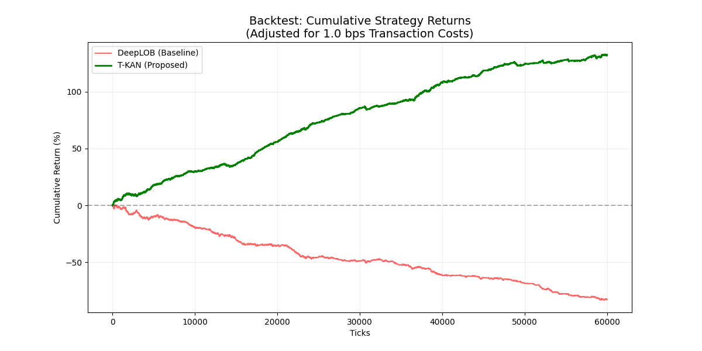

# Temporal-Kolmogorov-Arnold-Networks-T-KAN-for-High-Frequency-Limit-Order-Book-Forecasting
T-KAN for high-frequency LOB forecasting. Outperforming DeepLOB on the FI-2010 dataset with 132% backtest returns and FPGA-ready architecture

\begin{table}[h]
\centering
\caption{Comparative Performance and Backtest Results ($k=100$)}
\label{table:final_results}
\begin{tabular}{@{}lccc@{}}
\toprule
\textbf{Metric} & \textbf{DeepLOB} & \textbf{T-KAN} & \textbf{Improvement} \\ \midrule
Precision & 0.4604 & \textbf{0.5343} & +16.0\% \\
Recall & 0.4329 & \textbf{0.4748} & +9.7\% \\
F1-Score & 0.3354 & \textbf{0.3995} & \textbf{+19.1\%} \\
Net Return (1bps) & -82.76\% & \textbf{+132.48\%} & \textbf{+215.2\%} \\ \bottomrule
\end{tabular}
\end{table}

