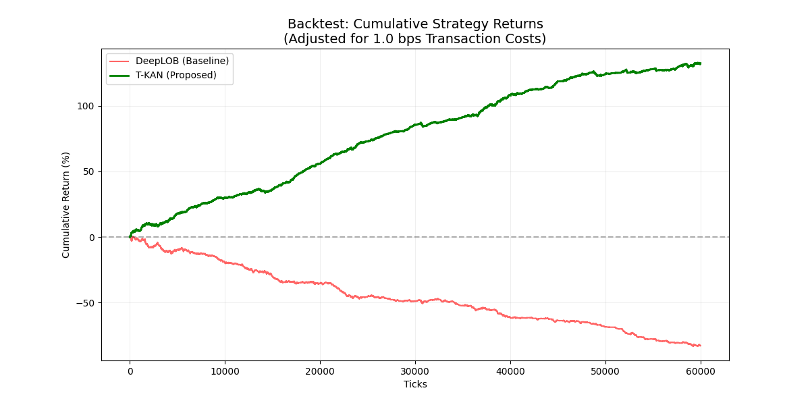

# Temporal-Kolmogorov-Arnold-Networks-T-KAN-for-High-Frequency-Limit-Order-Book-Forecasting
T-KAN for high-frequency LOB forecasting. Outperforming DeepLOB on the FI-2010 dataset with 132% backtest returns and FPGA-ready architecture

**Table 1. Comparative Performance and Backtest Results (k = 100)**

| **Metric** | **DeepLOB** | **T-KAN** | **Improvement** |
|------------|------------:|----------:|----------------:|
| Precision | 0.4604 | **0.5343** | +16.0% |
| Recall | 0.4329 | **0.4748** | +9.7% |
| F1-Score | 0.3354 | **0.3995** | **+19.1%** |
| Net Return (1bps) | -82.76% | **+132.48%** | **+215.2%** |

The code file within this repository does not seem to be working, the code for this project can be found here at https://colab.research.google.com/drive/1_7qDH6WPgJsACntacfIxjSaHQmxjwG4x?usp=sharing
